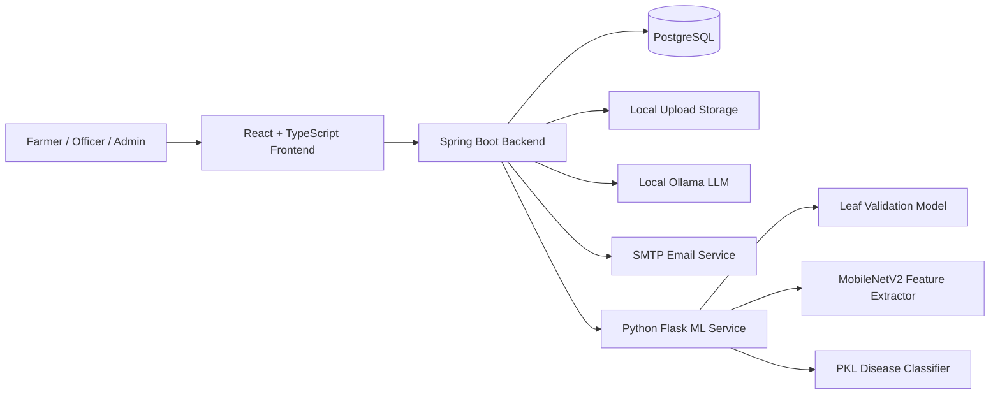
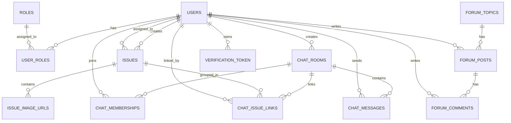
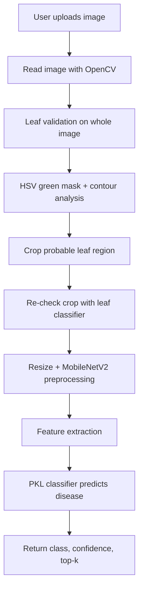

# Agri-verse Project Report

**Institution:** Islamic University of Technology (IUT)  
**Course:** Software Engineering and Object-Oriented Design Lab  
**Project Name:** Agri-verse  
**Prepared From:** Full-project static analysis of the uploaded source code, the provided reference report, the standalone ML service files, and the final presentation.

## Team Members

| Name | Student ID |
|---|---:|
| Khandakar Abu Talib Sifat | 220041246 |
| Samin Abdullah Rafi | 220041222 |
| Md. Sazidur Rahman | 220041226 |
| Adnan Samir | 220041236 |
| Saom Bin Khalid | 220041224 |
| Abdullah Al Fahad Diganta | 220041210 |

---

## Contents

1. Introduction  
2. Problem Context and Motivation  
3. Project Objectives  
4. Scope and Key Features  
5. System Architecture  
6. Module Design  
7. Database Schema Design  
8. API Design  
9. Frontend Design and User Flows  
10. ML and AI Components  
11. Source Code and Technology Stack  
12. Testing and Verification Analysis  
13. Strengths, Risks, and Code Quality Review  
14. Sustainability and Professional Practices  
15. Limitations  
16. Future Work  
17. Conclusion

---

# 1. Introduction

Agri-verse is an agriculture support platform designed to help farmers detect crop diseases early, receive AI-generated guidance, submit field issues with geographic context, and communicate with agricultural officers through an issue-driven collaboration workflow.

The platform combines four major capabilities into one system:

1. **AI-based leaf image validation and disease detection**  
2. **LLM-assisted advice generation for predicted diseases**  
3. **Issue lifecycle management between farmers and government officers**  
4. **Map-based monitoring, clustering, and collaborative chat support**

Unlike a simple image classifier, Agri-verse attempts to support the full workflow after diagnosis: prediction, advice, escalation, officer review, grouping of similar issues, and collaborative discussion.

---

# 2. Problem Context and Motivation

The project addresses a practical agricultural problem in Bangladesh: farmers often struggle to obtain timely disease diagnosis and expert support. Based on the supplied presentation, the motivation is built around several realities:

- Agricultural extension coverage is limited relative to the number of farming households.
- Crop disease can cause significant annual yield loss if not detected and treated early.
- Farmers frequently lack fast access to correct disease information and expert review.
- Regional disease patterns are difficult to monitor without location-linked reporting.

Agri-verse therefore aims to build a bridge among:

- farmers in the field,
- automated disease detection,
- AI-generated preliminary advice,
- human government officers,
- map-based monitoring of disease cases.

---

# 3. Project Objectives

The source code and presentation indicate the following main objectives:

| Objective ID | Objective |
|---|---|
| OBJ-01 | Detect plant disease from uploaded leaf images |
| OBJ-02 | Reject invalid or non-leaf images before disease inference |
| OBJ-03 | Provide disease-specific advice using a local LLM |
| OBJ-04 | Let farmers create location-aware issues for officer support |
| OBJ-05 | Allow officers to review, assign, forward, and resolve issues |
| OBJ-06 | Group similar issues into chat rooms for collaborative handling |
| OBJ-07 | Visualize officers and disease issues on an interactive map |
| OBJ-08 | Provide a community forum for discussion and knowledge sharing |
| OBJ-09 | Support a future-ready hybrid workflow where AI augments, but does not replace, agricultural officers |

---

# 4. Scope and Key Features

## 4.1 Major functional scope

The uploaded codebase covers the following functional areas.

### A. Authentication and account workflow
- User registration
- Login using email and password
- Email verification using tokenized verification links
- Resend verification support
- Role-based access control for normal users, government officers, and admins

### B. Disease detection workflow
- Image upload for disease prediction
- Leaf validation and cropping before inference
- ML prediction using a dedicated Python Flask service
- Top-k disease response handling in frontend/backend flow
- Advice generation using a local Ollama model with disease knowledge files

### C. Issue-first escalation workflow
- Farmers create issues from predictions or manually
- Issues include disease, confidence, note, crop name, images, and exact coordinates
- Officers can review disease, assign issues, update status, or forward them
- Issues can be forwarded to the nearest officer or to a shared pool

### D. Group collaboration workflow
- Officers create chat rooms from multiple issues
- Similar disease cases can be grouped into one room
- Farmers related to those issues become chat members
- Chat messages support human discussion and AI participation
- Ollama can respond as a visible AI participant in the chat room

### E. Map and monitoring workflow
- Officers have stored latitude and longitude
- Issues are exposed as map markers
- The frontend displays disease markers and officer markers using Leaflet
- This supports cluster observation and regional monitoring

### F. Forum workflow
- Forum topics
- Posts by authenticated users
- Comments on posts
- Search/filter over forum posts

## 4.2 Out-of-scope or only partially represented

The uploaded project does **not** contain full infrastructure descriptors or reproducible build metadata for complete runtime validation. Specifically:

- The backend archive does not include `pom.xml`, `build.gradle`, or wrapper files.
- The frontend archive does not include `package.json` or lock files.
- The PostgreSQL schema is generated implicitly through JPA/Hibernate rather than migration files in the uploaded snapshot.
- End-to-end deployment configuration is incomplete in the uploaded files.

---

# 5. System Architecture

## 5.1 High-level architecture

Agri-verse follows a **multi-service client-server architecture** rather than a single monolithic application.

## 5.2 Architectural responsibilities

| Layer | Responsibilities |
|---|---|
| Frontend | UI, routing, auth persistence, forms, API calls, map visualization, issue/chat/forum screens |
| Spring Boot backend | Business logic, security, role control, issue/chat/forum management, file serving, advice orchestration |
| Python ML service | Image preprocessing, leaf detection, crop extraction, disease inference |
| Ollama | Natural-language advice generation and chat assistance |
| PostgreSQL | Persistent storage of users, roles, issues, forums, chats, messages, verification tokens |
| Local uploads | Storage of uploaded issue images |

## 5.3 Architectural strengths

- Clear separation between transactional business logic and ML inference
- Issue-first workflow is more realistic than direct instant chat creation
- The AI service for advice and the AI service for chat are separated, which is good design
- Role-driven backend endpoints are well organized by controller responsibility

## 5.4 Architectural weaknesses

- Security configuration currently permits all routes at the URL layer and relies heavily on method security
- Important secrets are stored directly in `application.properties`
- Uploaded source snapshot lacks reproducible build metadata
- The file storage mechanism is local-only and not cloud-ready

---

# 6. Module Design

## 6.1 Backend modules

| Module | Main classes | Responsibility |
|---|---|---|
| Authentication | `UserController`, `JwtUtil`, `JwtFilter`, `CustomUserDetailsService` | Register, login, token generation, email verification |
| Security | `SecurityConfig` | CORS, filter chain, auth rules, password encoder |
| Issue Management | `IssueController`, `IssueService`, `IssueRepository` | Create, assign, review, edit, forward, resolve issues |
| Chat System | `ChatRoomController`, `ChatRoomService`, `ChatAiService` | Create chat rooms, send messages, AI replies, transfer or close chat |
| Map Module | `MapController`, `MapService` | Officer location updates and issue/officer mapping |
| Forum Module | `ForumController`, `ForumService`, repositories/specs | Topics, posts, comments, recent posts |
| ML Orchestration | `MlWorkflowController`, `MlPredictionService`, `AiAdviceService` | Prediction requests, advice generation, issue creation from ML flow |
| File Management | `FileController`, `FileStorageService` | Save and serve uploaded images |
| Bootstrapping / Seed | `RoleConfig`, `AdminConfig`, `AiUserConfig`, `DataSeeder` | Role creation, admin/officer seed, AI user seed, sample data |

## 6.2 Frontend modules

| Module | Main files | Responsibility |
|---|---|---|
| Routing | `App.tsx`, `ProtectedRoute.tsx`, `AdminRoute.tsx` | Page routing and protected screens |
| Auth | `AuthContext.tsx`, `api/auth.ts` | Login/register/logout, token persistence |
| Disease Detection | `pages/ml/DiseaseDetectionPage.tsx`, `api/ml.ts`, `api/issues.ts` | Upload image, show prediction, fetch advice, create issue |
| Issues | `pages/issues/IssuesPage.tsx`, `IssueDetailModal.tsx` | List, search, inspect, assign, review, group issues |
| Chats | `pages/chats/ChatRoomsPage.tsx`, `ChatRoomPage.tsx`, `api/chatrooms.ts` | Chat room listing, messaging, AI targeting |
| Map | `pages/MapPage.tsx`, `api/map.ts`, `use-geolocation.ts` | Leaflet map with issue and officer markers |
| Forum | `pages/forum/*`, `api/forum.ts` | Forum topics, posts, comments |
| Layout/UI | `components/layout/*`, `components/ui/*` | Shared navigation and reusable UI |

## 6.3 Functional workflow summary

### Disease workflow
1. User uploads image(s)
2. Backend sends image(s) to Flask ML service
3. ML service validates leaf and crops region
4. Disease classifier predicts class and confidence
5. Backend optionally calls Ollama for advice
6. User can create a location-aware issue from prediction

### Officer support workflow
1. Farmer submits issue
2. Officer sees issues in queue/pool/assigned list
3. Officer assigns issue to self or forwards it
4. Officer may review disease manually
5. Officer may group similar issues into a chat room
6. Farmers and officer discuss the grouped cases
7. Ollama may answer when directly targeted

---

# 7. Database Schema Design

The backend uses JPA entities to generate the schema. The following schema is derived from the uploaded entity classes.

## 7.1 Entity relationship overview

## 7.2 Table-by-table schema

### `users`

| Column | Type / Nature | Notes |
|---|---|---|
| id | PK, sequence | Primary key |
| username | unique, not null | Login identity for JWT subject |
| email | unique, not null | Used for registration/login |
| password | not null | BCrypt-hashed password |
| email_verified | boolean | Email verification gate |
| identification_number | unique, nullable | Required for govt officer registration |
| latitude | nullable | Last known user location |
| longitude | nullable | Last known user location |

### `roles`

| Column | Type / Nature | Notes |
|---|---|---|
| id | PK | Primary key |
| name | unique, not null | `ROLE_USER`, `ROLE_ADMIN`, `ROLE_GOVT_OFFICER` |

### `user_roles`

| Column | Type / Nature | Notes |
|---|---|---|
| user_id | FK -> users.id | Join table |
| role_id | FK -> roles.id | Join table |

### `verification_token`

| Column | Type / Nature | Notes |
|---|---|---|
| id | PK | Primary key |
| token | unique, not null | Verification token |
| user_id | FK -> users.id | Associated user |
| expires_at | not null | Expiration timestamp |

### `issues`

| Column | Type / Nature | Notes |
|---|---|---|
| id | PK, sequence | Primary key |
| prediction_id | nullable | Placeholder for prediction linkage |
| farmer_user_id | FK -> users.id | Farmer who created the issue |
| predicted_disease | not null | ML-predicted disease |
| reviewed_disease | nullable | Officer-corrected disease |
| diagnosis_source | enum | `ML`, `OFFICER_REVIEWED` |
| status | enum | `NEW`, `UNDER_REVIEW`, `GROUPED_IN_CHAT`, `RESOLVED`, `CLOSED` |
| note | text | Farmer notes |
| ai_advice | text | Advice snapshot |
| latitude | not null | Exact issue latitude |
| longitude | not null | Exact issue longitude |
| location_text | nullable | Human-readable location |
| crop_name | nullable | Crop name |
| confidence | nullable | Prediction confidence |
| assigned_officer_user_id | FK -> users.id, nullable | Assigned officer |
| created_at | not null | Timestamp |
| updated_at | nullable | Timestamp |

### `issue_image_urls`

| Column | Type / Nature | Notes |
|---|---|---|
| issue_id | FK -> issues.id | Parent issue |
| image_url | varchar(500) | Stored as element collection |

### `chat_rooms`

| Column | Type / Nature | Notes |
|---|---|---|
| id | PK, sequence | Primary key |
| title | not null | Chat title |
| disease_label | nullable | Optional grouping label |
| created_by_officer_id | FK -> users.id | Officer creator |
| status | enum | `ACTIVE`, `CLOSED` |
| created_at | not null | Timestamp |
| updated_at | nullable | Timestamp |

### `chat_memberships`

| Column | Type / Nature | Notes |
|---|---|---|
| id | PK, sequence | Primary key |
| chat_room_id | FK -> chat_rooms.id | Parent room |
| user_id | FK -> users.id | Member user |
| role_in_chat | enum | `OFFICER`, `FARMER`, `ADMIN`, `AI_ASSISTANT` |
| joined_at | not null | Timestamp |

Unique constraint: one membership per `(chat_room_id, user_id)`.

### `chat_messages`

| Column | Type / Nature | Notes |
|---|---|---|
| id | PK, sequence | Primary key |
| chat_room_id | FK -> chat_rooms.id | Parent room |
| sender_user_id | FK -> users.id | Sender |
| content | text, not null | Message body |
| type | enum | `TEXT`, `SYSTEM`, `AI_RESPONSE` |
| sender_type | varchar(10) | e.g. `USER`, `AI` |
| target_type | varchar(20) | e.g. `EVERYONE`, `OLLAMA` |
| created_at | not null | Timestamp |

### `chat_issue_links`

| Column | Type / Nature | Notes |
|---|---|---|
| id | PK, sequence | Primary key |
| chat_room_id | FK -> chat_rooms.id | Parent room |
| issue_id | FK -> issues.id | Linked issue |
| linked_by_officer_id | FK -> users.id | Officer who linked the issue |
| linked_at | not null | Timestamp |

Unique constraint prevents duplicate issue-link pairs.

### `forum_topics`

| Column | Type / Nature | Notes |
|---|---|---|
| id | PK | Primary key |
| name | unique, not null | Topic name |
| description | nullable | Topic description |

### `forum_posts`

| Column | Type / Nature | Notes |
|---|---|---|
| id | PK | Primary key |
| topic_id | FK -> forum_topics.id | Parent topic |
| author_id | FK -> users.id | Post author |
| title | not null | Title |
| content | text, not null | Body |
| created_at | not null | Timestamp |
| updated_at | not null | Timestamp |

### `forum_comments`

| Column | Type / Nature | Notes |
|---|---|---|
| id | PK | Primary key |
| post_id | FK -> forum_posts.id | Parent post |
| author_id | FK -> users.id | Comment author |
| content | text, not null | Comment body |
| created_at | not null | Timestamp |

## 7.3 Schema design observations

### Positive decisions
- The issue model is rich enough to preserve both ML and human-reviewed diagnoses.
- Chat grouping is normalized through a dedicated link table rather than embedding issue arrays into chat rooms.
- User-role mapping is standard and extensible.
- Image URLs are decoupled through an element collection table.

### Weak points
- No explicit migration scripts are included in the uploaded backend snapshot.
- Geospatial support currently uses plain latitude/longitude columns, not PostGIS geometry.
- There are no visible DB indexes defined for geolocation or common filtering fields.
- Some tables likely rely only on Hibernate defaults, which makes schema reproducibility weaker.

---

# 8. API Design

The backend controllers expose a fairly broad REST API. The following catalog is derived directly from the uploaded controller annotations.

## 8.1 Authentication APIs

| Method | Endpoint | Purpose |
|---|---|---|
| POST | `/auth/register` | Register farmer or government officer |
| POST | `/auth/login` | Login and receive JWT |
| GET | `/auth/verify-email` | Verify email using token |
| POST | `/auth/resend-verification` | Resend verification link |

## 8.2 ML and advice APIs

| Method | Endpoint | Purpose |
|---|---|---|
| POST | `/api/ml/predict` | Send one or more images for ML prediction |
| POST | `/api/ml/advice` | Generate disease advice using Ollama |
| POST | `/api/ml/create-issue` | Create issue directly from ML workflow |

## 8.3 Issue APIs

| Method | Endpoint | Purpose |
|---|---|---|
| POST | `/api/issues` | Create issue manually or directly |
| GET | `/api/issues/mine` | Farmer’s own issues |
| GET | `/api/issues/queue` | Officer queue |
| GET | `/api/issues/all` | All issues |
| GET | `/api/issues/pool` | Unassigned/shared issue pool |
| GET | `/api/issues/assigned` | Issues assigned to current officer |
| GET | `/api/issues/map` | Map markers for issues |
| GET | `/api/issues/{id}` | Get issue detail |
| POST | `/api/issues/{id}/assign` | Assign issue to self |
| POST | `/api/issues/{id}/review-disease` | Officer review of disease |
| POST | `/api/issues/{id}/status` | Change issue status |
| POST | `/api/issues/{id}/forward` | Forward to another officer |
| POST | `/api/issues/{id}/forward-to-pool` | Return issue to pool |
| PUT | `/api/issues/{id}` | Edit issue fields |

## 8.4 Chat APIs

| Method | Endpoint | Purpose |
|---|---|---|
| POST | `/api/chats` | Create chat room from selected issues |
| POST | `/api/chats/{id}/add-issues` | Add more issues to existing chat |
| GET | `/api/chats/{id}` | Chat detail |
| GET | `/api/chats` | Chat room list |
| GET | `/api/chats/mine` | Current user’s chat rooms |
| GET | `/api/chats/active` | Active chat rooms |
| GET | `/api/chats/by-disease` | Active rooms filtered by disease |
| GET | `/api/chats/{id}/messages` | Message history |
| POST | `/api/chats/{id}/messages` | Send message; optionally target Ollama |
| POST | `/api/chats/{id}/close` | Close chat |
| POST | `/api/chats/{id}/transfer` | Transfer chat to another officer |
| POST | `/api/chats/{id}/remove-issue` | Remove issue from chat |

## 8.5 Forum APIs

| Method | Endpoint | Purpose |
|---|---|---|
| GET | `/api/forum/topics` | List topics |
| POST | `/api/forum/topics` | Create topic |
| POST | `/api/forum/posts` | Create post |
| GET | `/api/forum/topics/{topicId}/posts` | List posts under topic |
| GET | `/api/forum/posts/{postId}` | Get post detail |
| POST | `/api/forum/posts/{postId}/comments` | Add comment |
| GET | `/api/forum/posts/{postId}/comments` | List comments |
| GET | `/api/forum/posts/mine` | User’s recent posts |

## 8.6 Map, file, utility, and test APIs

| Method | Endpoint | Purpose |
|---|---|---|
| GET | `/api/map/officers` | Get government officer locations |
| PUT | `/api/map/officers/{id}/location` | Update specific officer location |
| PUT | `/api/map/my-location` | Update current user location |
| GET | `/api/files/{filename}` | Serve uploaded file |
| GET | `/api/users/govt-officers` | Officer lookup |
| GET | `/api/util/user-info/{username}` | Utility user info lookup |
| POST | `/api/util/grant-admin-access` | Utility/admin-related endpoint |
| GET | `/api/test/all` | Test endpoint |
| GET | `/api/test/user` | Test endpoint |

## 8.7 API design assessment

### Good design points
- Controllers are grouped by concern.
- Endpoint naming is mostly consistent.
- Issue and chat APIs map well to the real workflow.
- Path-variable constraints for issue IDs help route clarity.

### Problems and risks
- Some utility/test endpoints should not be publicly present in production.
- Security config currently permits all request paths globally before `.anyRequest().authenticated()`, which weakens URL-layer protection.
- There is limited evidence of standardized error payloads.
- No OpenAPI/Swagger generation output is included in the uploaded snapshot.

---

# 9. Frontend Design and User Flows

## 9.1 Routing structure

The frontend uses `react-router-dom` and protects screens through `ProtectedRoute` and `AdminRoute`.

### Main pages discovered

| Route | Page |
|---|---|
| `/` | Landing page |
| `/login` | Login page |
| `/register` | Register page |
| `/verify-email` | Email verification page |
| `/resend-verification` | Resend verification page |
| `/check-email` | Check email page |
| `/dashboard` | User dashboard |
| `/profile` | User profile |
| `/map` | Disease and officer map |
| `/forum` | Forum topics |
| `/forum/topics/:topicId` | Posts under a topic |
| `/forum/posts/:postId` | Post details |
| `/admin` | Admin page |
| `/gov/dashboard` | Government officer dashboard |
| `/issues` | Issue listing and management |
| `/chats` | Chat room list |
| `/chats/:id` | Chat room page |
| `/ml/disease` | Disease detection workflow |

## 9.2 UI and interaction design notes

The frontend appears to use:

- React + TypeScript
- Tailwind-style utility classes
- a large reusable UI component library under `components/ui`
- React Query for data fetching support
- Leaflet for maps
- Axios for API requests

## 9.3 Important UX flows

### Farmer disease flow
1. Upload one or more leaf images
2. Preview selected files
3. Run prediction
4. View leaf validation result and disease prediction
5. Fetch English/Bangla advice
6. Forward prediction into issue workflow
7. Attach location and note

### Officer review flow
1. Open issue queue or assigned issues
2. Inspect issue details and images
3. Assign to self
4. Review/correct disease label
5. Update status or group issue into chat

### Map flow
1. Load officer markers and issue markers
2. Toggle filters by crop/disease/officers
3. Inspect issue popup/detail modal
4. Use geolocation and fly-to behavior

### Chat flow
1. Open chat room
2. View members and linked issues
3. Send message to everyone or target Ollama
4. View AI assistant responses in-thread
5. Transfer or close room if authorized

---

# 10. ML and AI Components

## 10.1 Python ML service overview

The uploaded standalone ML service consists of two important files:

- `app.py` — Flask API service
- `leaf_filter.py` — leaf validation and cropping logic

## 10.2 ML processing pipeline

The pipeline is stronger than a naive direct-classification system.

## 10.3 Leaf validation logic

The leaf-filtering stage uses a mix of:

- leaf-vs-non-leaf model scoring,
- HSV green masking,
- connected-component analysis,
- contour area filtering,
- solidity, fill ratio, prominence, and aspect-ratio heuristics.

This is a good practical engineering decision because it reduces false predictions on bad uploads such as:

- background scenes,
- distant plants,
- fragmented leaves,
- non-leaf objects.

## 10.4 Disease classifier flow

The Flask app:

1. loads a serialized classifier bundle from `plant_disease_classifier.pkl`,
2. loads a MobileNetV2 feature extractor from a Keras model,
3. preprocesses the cropped image,
4. extracts features,
5. predicts disease index and class name,
6. optionally returns confidence and top-5 probabilities.

## 10.5 Advice generation design

The backend advice engine:

- loads disease knowledge text files from `src/main/resources/knowledge/`
- chooses the most relevant disease knowledge entry using candidate-key matching
- builds a structured prompt for Ollama
- asks the LLM to return **strict JSON** with both English and Bangla versions
- falls back to default advice if generation fails

This is a well-designed hybrid approach because it constrains the LLM with project-local domain knowledge instead of asking for purely free-form advice.

## 10.6 Chat AI design

`ChatAiService` is separated from `AiAdviceService`, which is a strong design choice. The two AI subsystems have different purposes:

| AI subsystem | Purpose |
|---|---|
| `AiAdviceService` | Generate disease advice from prediction context |
| `ChatAiService` | Participate as a visible assistant inside chat rooms |

The chat prompt includes:

- room title,
- disease label,
- participants,
- linked issues,
- recent conversation history,
- the current targeted question.

That makes the AI response much more context-aware than a simple single-message prompt.

---

# 11. Source Code and Technology Stack

## 11.1 Confirmed backend stack

| Technology | Evidence from code | Purpose |
|---|---|---|
| Java + Spring Boot | package structure, controllers, services | Main backend |
| Spring Security | `SecurityConfig`, JWT classes | Auth and access control |
| Spring Data JPA | repositories and entity annotations | Persistence |
| PostgreSQL | `spring.datasource.url` | Database |
| WebClient | `WebClientsConfig`, service usage | ML/Ollama HTTP calls |
| BCrypt | password encoder | Password hashing |
| Java Mail | `EmailService`, mail properties | Verification emails |

## 11.2 Confirmed frontend stack

| Technology | Evidence from code | Purpose |
|---|---|---|
| React | page/component structure | UI |
| TypeScript | `.tsx`, typed API files | Type safety |
| React Router | `App.tsx` | Routing |
| Axios | `api/client.ts` | API calls |
| TanStack React Query | `App.tsx` | Query orchestration |
| Leaflet / react-leaflet | `MapPage.tsx` | Interactive map |
| Lucide icons | many pages | UI icons |

## 11.3 Confirmed ML/AI stack

| Technology | Evidence from code | Purpose |
|---|---|---|
| Flask | `app.py` | ML API service |
| TensorFlow/Keras | model loading in `app.py`, `leaf_filter.py` | Leaf and feature models |
| OpenCV | image processing | Cropping and masking |
| NumPy | vector operations | Inference pipeline |
| Joblib | load classifier bundle | Traditional ML classifier |
| Ollama | `AiAdviceService`, `ChatAiService` | Local LLM responses |

## 11.4 Knowledge base coverage

Knowledge files are included for diseases such as:

- Bacterial blight
- Blast
- Brown spot
- Tungro
- Potato early blight / late blight / healthy
- Tomato bacterial spot / early blight / late blight / leaf mold / septoria / target spot / mosaic virus / yellow leaf curl virus / healthy

That indicates the project is not just a classifier demo; it includes curated disease-specific textual knowledge for downstream guidance.

---

# 12. Testing and Verification Analysis

## 12.1 What was possible to verify from the uploaded project

I performed a **static verification** of the full uploaded project structure:

- all backend controllers and endpoint mappings were inspected,
- core services and entity models were inspected,
- frontend routes and API client usage were inspected,
- the standalone ML service code was inspected,
- the sample report and final presentation were used as formatting/context references.

## 12.2 What could not be honestly claimed as fully executed

Full runtime execution of the complete application stack could **not** be reproduced from the uploaded project snapshot alone because:

| Missing/blocked item | Impact |
|---|---|
| No `pom.xml` / Gradle files in backend zip | Backend cannot be built or tested reproducibly from the provided archive |
| No `package.json` in frontend zip | Frontend cannot be installed or run reproducibly from the provided archive |
| No DB dump or container config | End-to-end API validation against PostgreSQL cannot be reproduced here |
| ML model files not included with the standalone Flask app | Flask prediction endpoint cannot be run end-to-end here |

Because of those missing artifacts, any claim like “all API requests were executed successfully” would be misleading.

## 12.3 Verification status by subsystem

| Subsystem | Static Code Verification | Runtime Verification | Notes |
|---|---|---|---|
| Authentication | Yes | Not fully reproducible | Backend controller logic present; build metadata missing |
| Issue workflow | Yes | Not fully reproducible | Endpoints and service flow present |
| Chat workflow | Yes | Not fully reproducible | Full code path exists including AI targeting |
| Forum workflow | Yes | Not fully reproducible | Controller/service/API linkage present |
| Map workflow | Yes | Not fully reproducible | Frontend and backend map logic present |
| ML Flask service | Yes | Partial only | Code available, but required model files are absent |
| Ollama advice/chat | Yes | Not reproducible here | Depends on local Ollama runtime |

## 12.4 Static API consistency check

The frontend API clients align well with backend endpoint paths. Examples:

| Frontend call | Backend endpoint match | Result |
|---|---|---|
| `authApi.login()` | `POST /auth/login` | Consistent |
| `issuesApi.createFromMl()` | `POST /api/ml/create-issue` | Consistent |
| `chatRoomsApi.sendMessage()` | `POST /api/chats/{id}/messages` | Consistent |
| `forumApi.listTopics()` | `GET /api/forum/topics` | Consistent |
| `issuesApi.mapMarkers()` | `GET /api/issues/map` | Consistent |

## 12.5 Important defect already visible from static analysis

A previously shared runtime error in the conversation showed a database check-constraint failure around `chat_messages.type`. That is consistent with a schema/application mismatch risk when enums evolve. This indicates the codebase would benefit from:

- explicit DB migrations,
- schema versioning,
- startup validation for enum constraints,
- integration tests for chat message persistence.

## 12.6 Recommended test plan for the final submitted project

### Authentication test cases
| TC | Scenario | Expected |
|---|---|---|
| AUTH-01 | Register farmer account | Success response and verification email token generation |
| AUTH-02 | Register govt officer without ID | Validation error |
| AUTH-03 | Login before verification | Rejected |
| AUTH-04 | Verify email with valid token | Account verified |
| AUTH-05 | Login after verification | JWT returned |

### ML workflow test cases
| TC | Scenario | Expected |
|---|---|---|
| ML-01 | Upload valid leaf image | Disease prediction returned |
| ML-02 | Upload non-leaf image | `is_leaf = false` returned |
| ML-03 | Request advice for known disease | Structured English/Bangla advice |
| ML-04 | Create issue from prediction | Issue stored with location and images |

### Issue workflow test cases
| TC | Scenario | Expected |
|---|---|---|
| ISSUE-01 | Farmer creates issue | Issue status `NEW` |
| ISSUE-02 | Officer assigns issue to self | `assignedOfficer` updated |
| ISSUE-03 | Officer reviews disease | `reviewedDisease` updated |
| ISSUE-04 | Officer forwards issue | Assignment changes to target officer |
| ISSUE-05 | Officer returns issue to pool | Assigned officer becomes null |

### Chat workflow test cases
| TC | Scenario | Expected |
|---|---|---|
| CHAT-01 | Officer creates chat from issues | Chat room created; farmers added |
| CHAT-02 | Member sends standard message | Message stored with `TEXT` type |
| CHAT-03 | Member targets Ollama | AI response message generated |
| CHAT-04 | Officer closes chat | Chat status becomes `CLOSED` |

### Forum and map test cases
| TC | Scenario | Expected |
|---|---|---|
| FM-01 | Create forum post | Post stored |
| FM-02 | Add comment | Comment stored |
| FM-03 | Load map markers | Officer and issue markers returned |
| FM-04 | Update my location | User coordinates updated |

---

# 13. Strengths, Risks, and Code Quality Review

## 13.1 Main strengths

### 1. Realistic domain workflow
The project does not stop at classification. It models a practical agricultural support process from diagnosis to escalation to human review.

### 2. Good module separation
Advice generation, chat AI, ML prediction, and issue management are separated into distinct services.

### 3. Rich issue model
The issue entity stores disease, confidence, images, notes, geolocation, and both ML and human-reviewed states.

### 4. Strong ML pre-filtering idea
The leaf detection pipeline is more robust than directly classifying every uploaded image.

### 5. Meaningful map integration
The map is not decorative; it is connected to officers and location-tagged issues.

### 6. Group support via chat rooms
Grouping multiple similar issues into one chat room is a strong systems-design feature and aligns with real extension-service constraints.

## 13.2 Key risks and code-quality issues

### 1. Secrets in source configuration
`application.properties` contains plaintext credentials and sensitive values. This is a serious security issue.

### 2. Over-permissive security rule
`SecurityConfig` currently contains:

- `requestMatchers("/**").permitAll()`

This weakens URL-level access protection and should be removed or narrowed.

### 3. Missing reproducible build files in uploaded snapshot
Without build manifests, the project is harder to verify, deploy, or grade reproducibly.

### 4. Local file storage only
Image uploads are stored locally, which is simple for development but weak for production deployment and scaling.

### 5. Schema migration discipline is unclear
The visible enum mismatch issue suggests the project needs formal migration/version management.

### 6. Sparse visible automated tests in uploaded snapshot
Only a placeholder Spring test class is present in the backend upload. This does not reflect the complexity of the project.

## 13.3 Suggested improvements

| Priority | Recommendation |
|---|---|
| High | Move all secrets to environment variables or `.env`/vault-based config |
| High | Remove global `permitAll` and verify endpoint authorization rigorously |
| High | Add migration scripts using Flyway or Liquibase |
| High | Restore full build files (`pom.xml`, `package.json`) in final submission |
| Medium | Add integration tests for auth, issues, chats, and forum |
| Medium | Add DB indexes on issue status, assigned officer, and location fields |
| Medium | Replace local upload storage with object storage in production |
| Medium | Add DTO-level validation annotations and unified error responses |

---

# 14. Sustainability and Professional Practices

## 14.1 Scalability

The architecture is moderately scalable because:

- ML service is separated from backend logic,
- the LLM is accessed as an external service endpoint,
- frontend and backend are decoupled,
- chat grouping reduces repetitive officer effort.

However, scalability is limited by:

- local file storage,
- missing explicit production deployment strategy,
- lack of visible async queueing for long-running tasks,
- no visible caching layer.

## 14.2 Maintainability

Maintainability is helped by:

- controller/service/repository separation,
- typed DTOs,
- modular frontend APIs,
- role-based domain modeling.

Maintainability is harmed by:

- missing migration/versioning artifacts,
- missing build manifests in the provided snapshot,
- hardcoded configuration values and secrets.

## 14.3 Reusability

Reusable elements include:

- generic chat architecture,
- forum architecture,
- issue management pattern,
- map marker APIs,
- knowledge-grounded advice generation pattern.

## 14.4 Ethical and practical value

The project has strong social value because it attempts to improve:

- early crop disease detection,
- farmer access to guidance,
- officer workload management,
- regional awareness of outbreaks.

The use of a human review layer is especially important because it reduces blind over-reliance on the model.

---

# 15. Limitations

The current uploaded system has several limitations.

1. **Runtime reproducibility is incomplete** because build files are missing from the uploaded archives.  
2. **The backend security configuration is not production-safe in its current form.**  
3. **Database evolution control is weak** without visible migration scripts.  
4. **Local file storage limits deployment flexibility.**  
5. **The ML service depends on local model files** that were not included with the standalone Flask upload.  
6. **The frontend and backend require additional packaging artifacts** for a full reproducible run.  
7. **Automated tests are underrepresented** in the provided code snapshot relative to project complexity.

---

# 16. Future Work

The following future improvements would significantly strengthen Agri-verse.

## 16.1 Engineering improvements
- Add complete build/deployment files in final repository
- Introduce Flyway/Liquibase migrations
- Add unit and integration tests for all core workflows
- Containerize backend, frontend, DB, Flask ML service, and Ollama configuration
- Move secrets to environment variables

## 16.2 Product improvements
- Add officer dashboards with hotspot analytics
- Add map clustering and outbreak alerts
- Add multilingual support beyond English/Bangla
- Add farmer history and treatment tracking
- Add offline-first image queueing for poor-connectivity regions

## 16.3 AI/ML improvements
- Improve dataset and evaluation reporting
- Add model explainability or confidence visualization
- Add crop-specific treatment recommendation ranking
- Add hybrid officer feedback loops to continuously improve predictions
- Add structured RAG retrieval over agricultural documents instead of only text files

---

# 17. Conclusion

Agri-verse is a strong and meaningful software engineering project that goes beyond a simple ML demo. It combines machine learning, LLM-based guidance, spatial issue tracking, collaborative chat workflows, and role-based administration into a single agricultural support platform.

Its biggest strengths are:

- a realistic issue-first support workflow,
- grouping of related disease cases into collaborative chats,
- a practical leaf-validation stage before disease inference,
- knowledge-grounded AI advice generation,
- useful map integration for disease monitoring.

Its biggest weaknesses are mostly engineering maturity issues rather than concept problems:

- secrets stored in config,
- over-permissive security rule,
- missing build/deployment files in the uploaded snapshot,
- limited visible automated testing.

Overall, the project demonstrates solid system design thinking, practical agricultural relevance, and good architectural instincts. With tighter security, reproducible packaging, and stronger automated testing, Agri-verse could become a very compelling academic capstone and a realistic foundation for a real-world agricultural advisory platform.

---

## Appendix A: Evidence sources used for this report

This report was prepared by analyzing:

1. uploaded backend source archive,
2. uploaded frontend source archive,
3. standalone ML service files (`app.py`, `leaf_filter.py`),
4. the supplied sample final report PDF,
5. the supplied final presentation PDF.

## Appendix B: Submission note

This report is intentionally written to be **honest** about what was verified from code versus what could not be fully executed from the uploaded snapshot alone.
